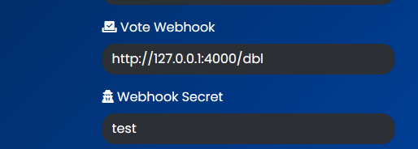

# Real-Time Voting Check

## Prerequisites

Before you get started, make sure you have the following:

1. A Discord bot token: You will need a Discord bot token to interact with the Discord API and receive vote notifications.
2. A bot list API: Choose a bot list website that provides an API to check for new votes and retrieve vote information. We will use the example of `https://braxybots.eu.org` in this guide.

## Step 1: Set Up a Webhook

To receive real-time vote notifications, we will use a webhook provided by the bot list API. You can create a webhook on the bot list website and provide the webhook URL during bot initialization.



## Step 2: Listen for Webhook Events

In your bot's code, listen for incoming webhook events. When a user votes for your bot on the bot list website, the webhook will be triggered, and your bot will receive the vote information.

JavaScript Example Code:

```javascript
const express = require('express');
const bodyParser = require('body-parser');
const PORT = "3000";

const app = express();
app.use(bodyParser.json());

app.post('/vote', (req, res) => {
    try {
        const { user_id } = req.body; // Assuming the vote data is sent in the request body

        // Perform any required validation or processing with the vote data here

        // Return a response to the vote webhook indicating success
        return res.status(200).json({ message: 'Vote received successfully' });
    } catch (error) {
        // Return an error response if there's an issue with the vote data
        return res.status(400).json({ error: error.message });
    }
});

app.listen(PORT, () => {
    console.log(`Server is running on port ${PORT}`);
});
```

Python Example Code:

```python
from flask import Flask, request, jsonify

app = Flask(__name__)

@app.route('/vote', methods=['POST'])
def handle_vote():
    try:
        data = request.json  # Assuming the vote data is sent in JSON format
        user_id = data.get('user_id')

        # Perform any required validation or processing with the vote data here

        # Return a response to the vote webhook indicating success
        return jsonify({"message": "Vote received successfully"}), 200
    except Exception as e:
        # Return an error response if there's an issue with the vote data
        return jsonify({"error": str(e)}), 400

if __name__ == '__main__':
    app.run()

```

### Step 3: Process Vote Information

Once you receive the vote information, you can process it and update your bot's data accordingly. The vote information usually contains details such as the user who voted, their Discord ID, the bot they voted for, the vote timestamp, and more.

You can use this information to keep track of votes, send thank-you messages to users who voted, update vote counts, or grant rewards to voters.

### Step 4: Respond to Users

After processing the vote, you can send a response to the user to acknowledge their vote and provide them with any rewards or incentives you offer.

### Available Vote Information

The vote information sent by the bot list API typically includes:








Vote Webhook Secret



The username of the user who voted.



The avatar URL of the user who voted.



The username of the bot that received the vote.



The Discord ID of the user who voted.



```json
{
  "userVoted": "JohnDoe#1234",
  "avatar": "https://example.com/avatar/johndoe.png",
  "username": "CoolBot",
  "userId": "123456789012345678",
  "botID": "987654321098765432",
  "votes": 42
}
```



You can use this information to customize your response to the user and perform any desired actions based on the vote.

That's it! By following these steps, your bot will be able to receive real-time vote notifications and handle vote information effectively.


Remember to keep your bot token and webhook URL secure and do not share them with anyone.


**Happy voting!** 🎉
